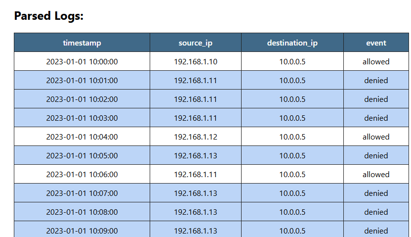
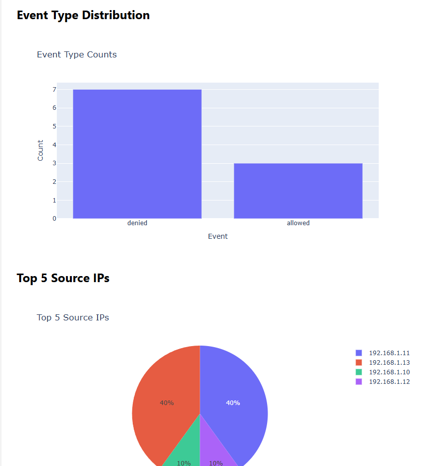
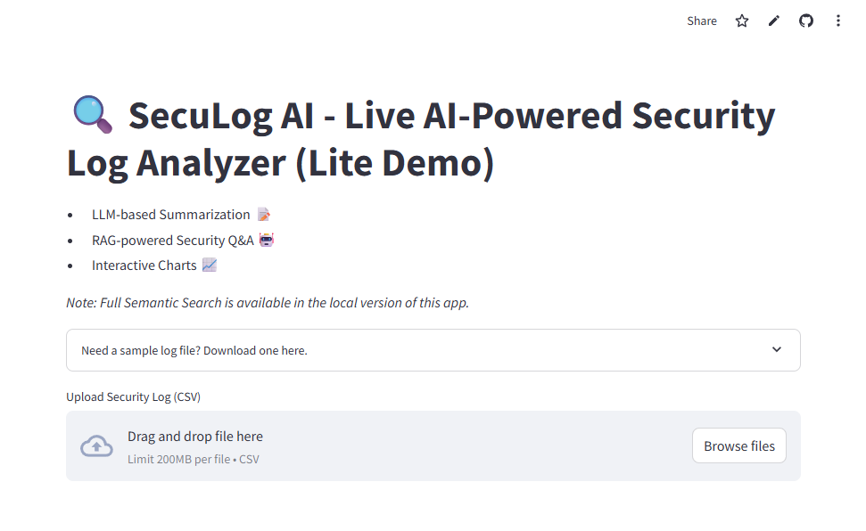
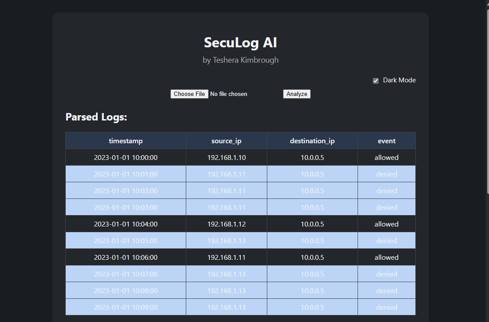

# SecuLog AI &nbsp;    

> **Modern, web-based log analysis dashboard for security and IT teams. Instantly visualize, detect, and highlight threats.**
>
>   

---

## Table of Contents

- [Features](#-features)
- [Use Cases / Impact](#-use-cases--impact)
- [Why I Built This](#-why-i-built-this)
- [Project Structure](#-project-structure)
- [Parsed Logs (Table View)](#️-parsed-logs-table-view)
- [Charts & Analytics](#-charts--analytics)
- [Demo](#demo)
- [How It Works](#-how-it-works)
- [Tech Stack](#-tech-stack)
- [Quick Start](#-quick-start)
- [Sample Log File](#-sample-log-file)
- [Customization](#️-customization)
- [Contributing](#-contributing)
- [License](#-license)
- [About & Contact](#-about--contact)
- [Connect With Me](#-connect-with-me)

---

## ✨ Features

- **Web-based dashboard:** Upload and analyze security log files (.csv)
- **Detection logic:** Flags suspicious (“denied”) and brute-force attempts
- **Visual analytics:** Interactive bar and pie charts (event types, top source IPs)
- **Professional UI:** Responsive, modern look with dark mode toggle
- **Beginner-friendly:** Easy to set up and extend

---

## 🤖 AI-Powered Features (NEW)

SecuLog AI now integrates **AI and ML** to provide deeper insights into your security logs:

- **Semantic Search:**  
  Use natural language queries to search across logs using vector embeddings and AI-powered search.

- **LLM-Based Summarization:**  
  Automatically generate human-readable summaries of log activity, highlighting suspicious patterns and key events.

- **AI-Based Anomaly Detection:**  
  Detect unusual patterns in log data with advanced ML models (Isolation Forest, Autoencoders).

- **(Beta) RAG-Powered Security Q&A:**  
  Ask natural language security questions — AI combines your log data with cybersecurity knowledge to generate actionable answers.

These AI features make SecuLog AI a powerful tool for both professional security analysts and learners exploring AI + cybersecurity.

---

## 🚨 Use Cases / Impact

- **Security teams:** Rapidly detect brute-force attempts and denied access patterns
- **Network admins:** Visualize traffic and troubleshoot anomalies
- **Students/learners:** Learn cybersecurity, Python, and data analysis all in one app

---

## 💡 Why I Built This

I wanted to bridge my IT security experience with data analytics, AI, and ML engineering,
so I built SecuLog AI as a real-world tool to help security teams spot threats quickly—while expanding my skills in AI-powered log analysis and intelligent security tools.

---

## 📂 Project Structure

seculog-ai/
├── app.py
├── requirements.txt
├── data/
│ └── sample_logs.csv
├── src/
│ ├── parser.py
│ └── ... (other modules)
└── templates/
└── index.html

---

## 🖥️ Parsed Logs (Table View)


---
## 📈 Charts & Analytics

Below is an example of the interactive charts generated by SecuLog AI.  
Visualizations help quickly spot trends and suspicious activity in your logs.



---
## Demo

| Light Mode | Dark Mode |
|:----------:|:---------:|
|  |  |

## ✨ AI-Powered Features

**Live Demo (Streamlit Cloud):**
- LLM-based Log Summarization 📝
- RAG-powered Security Q&A 🤖
- Interactive Visual Analytics 📈

**Available in Local Version:**
- Full Semantic Search using SentenceTransformers and vector search.

*Note: Due to Streamlit Cloud limitations, Semantic Search is available in the local version only.*

---
## 🛡️ How It Works

1. **Upload a log file** via the web interface.
2. **SecuLog AI parses and analyzes** the logs for “denied” events and brute-force attempts.
3. **Suspicious events are highlighted** (red for denied, blue for brute-force).
4. **Charts visualize** event types and top IPs.
---
## 🛠️ Tech Stack

- [Python 3.9+](https://www.python.org/)
- [Flask](https://flask.palletsprojects.com/) (web app)
- [Pandas](https://pandas.pydata.org/) (data analysis)
- [Plotly](https://plotly.com/python/) (interactive charts)
- [HTML/CSS/JS](https://developer.mozilla.org/en-US/docs/Web/HTML) (dashboard UI)
---
## ⚡ Quick Start

```bash
# 1. Clone this repo
git clone https://github.com/tesherakimbrough/seculog-ai.git
cd seculog-ai

# 2. Create a virtual environment
python -m venv venv

# 3. Activate it
# On Windows:
venv\Scripts\activate
# On Mac/Linux:
source venv/bin/activate

# 4. Install dependencies
pip install -r requirements.txt

# 5. Run the app!
python app.py

# 6. Open your browser at
http://127.0.0.1:5000
```

---

## 🗃️ Sample Log File

```csv
timestamp,source_ip,destination_ip,event
2023-01-01 10:00:00,192.168.1.10,10.0.0.5,allowed
2023-01-01 10:01:00,192.168.1.11,10.0.0.5,denied
2023-01-01 10:02:00,192.168.1.11,10.0.0.5,denied
2023-01-01 10:03:00,192.168.1.11,10.0.0.5,denied
2023-01-01 10:04:00,192.168.1.12,10.0.0.5,allowed
2023-01-01 10:05:00,192.168.1.13,10.0.0.5,denied
2023-01-01 10:06:00,192.168.1.11,10.0.0.5,allowed
2023-01-01 10:07:00,192.168.1.13,10.0.0.5,denied
2023-01-01 10:08:00,192.168.1.13,10.0.0.5,denied
2023-01-01 10:09:00,192.168.1.13,10.0.0.5,denied
```
---

🖌️ Customization
Change detection rules in src/parser.py

Modify dashboard layout in templates/index.html

Add new charts or export features (PDF/CSV) to stand out even more!

---

🤝 Contributing
Pull requests are welcome!
If you have suggestions for improvements or want to learn Python/web/app/AI together, let’s connect.

---

📝 License
This project is released under the MIT License.

---

🙋 About & Contact
Created by Teshera Kimbrough
GitHub • Medium • Email

---

[](https://www.linkedin.com/in/tesherakimbrough/)
[](https://github.com/tesherakimbrough)
[](https://medium.com/tesherakimbrough)
[](teshera.kimbrough@gmail.com)


