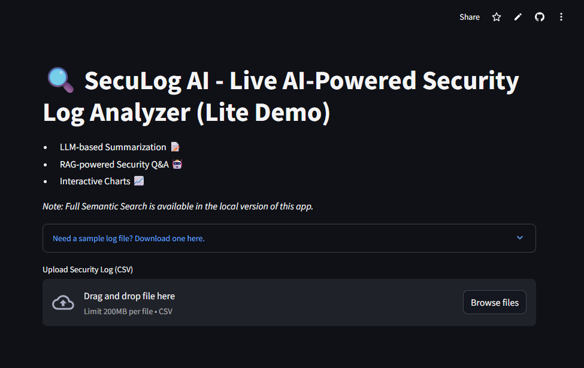

# 🔠SecuLog AI      

<p align="center">
  
</p>

[](https://seculog-ai-demo.streamlit.app)

> **Modern, AI-powered log analysis dashboard for security and IT teams. Instantly visualize, detect, and highlight threats using LLMs, RAG, and visual analytics.**

  

---

## ✨ Features

- **AI-Powered Analysis**
  - **LLM-based Log Summarization** (Ollama, OpenAI, or Demo Mode—no key required!)
  - **RAG-powered Security Q&A** (Ollama, OpenAI, or Demo Mode)
  - **Visual Analytics:** Interactive event & IP charts
  - **Log Export:** Download your analyzed logs as CSV
  - **Semantic Search:** Local version only (not in demo)
- **Modern Web Dashboard:** Upload, parse, and analyze logs via browser
- **Error-proof:** Friendly warnings if data/columns missing, onboarding expander, sample file included
- **Professional UI:** Dark/light mode toggle (Settings menu, top right)

---

## 🚀 Live Demo

[](https://seculog-ai-demo.streamlit.app)

> *Cloud demo includes all features except Semantic Search (local-only).*
> - **LLM tabs**: Use Ollama (local), OpenAI API key, or “Demo Mode” (sample output, always works)
> - **Try with your own logs, or the sample below!**

---

## Table of Contents

- [Features](#features)
- [Live Demo](#live-demo)
- [Use Cases / Impact](#use-cases--impact)
- [Why I Built This](#why-i-built-this)
- [Sample Log File](#sample-log-file)
- [Quick Start](#quick-start)
- [Project Structure](#project-structure)
- [Charts & Analytics](#charts--analytics)
- [Tech Stack](#tech-stack)
- [Customization](#️-customization)
- [Contributing](#-contributing)
- [License](#-license)
- [About & Contact](#-about--contact)

---

## 🚨 Use Cases / Impact

- **Security teams:** Detect brute-force attempts and denied access patterns
- **Network admins:** Visualize traffic and investigate anomalies
- **Learners:** Practice cybersecurity, data analysis, and AI/LLM workflows

---

## 💡 Why I Built This

I wanted to bridge my IT security experience with data analytics, AI, and ML engineering,  
so I built SecuLog AI as a real-world tool to help security teams spot threats quickly—while expanding my skills in AI-powered log analysis and intelligent security tools.

---

## 🗃️ Sample Log File

A sample log file is included for instant testing and demo.

[Download sample_logs.csv](data/sample_logs.csv)

```csv
timestamp,source_ip,destination_ip,event,log_message
2023-01-01 10:00:00,192.168.1.10,10.0.0.5,allowed,Accepted connection from 192.168.1.10
2023-01-01 10:01:00,192.168.1.11,10.0.0.5,denied,Denied connection from 192.168.1.11
2023-01-01 10:02:00,192.168.1.12,10.0.0.5,denied,Denied connection from 192.168.1.12
2023-01-01 10:03:00,192.168.1.13,10.0.0.5,allowed,Accepted connection from 192.168.1.13
2023-01-01 10:04:00,192.168.1.14,10.0.0.5,denied,Denied connection from 192.168.1.14
```

---

## ⚡ Quick Start

 1. Clone this repo
git clone https://github.com/tesherakimbrough/seculog-ai.git
cd seculog-ai

 2. (Optional) Create and activate a virtual environment
python -m venv venv
 Windows: venv\Scripts\activate
 Mac/Linux: source venv/bin/activate

 3. Install dependencies
pip install -r requirements.txt

 4. Run the Lite Streamlit demo (recommended for Cloud)
streamlit run seculog_ai_demo.py

 5. Or run the full Flask app (local Semantic Search, advanced)
python app.py

---

## 📂 Project Structure

seculog-ai/
├── app.py
├── seculog_ai_demo.py
├── requirements.txt
├── data/
│   └── sample_logs.csv
├── src/
│   ├── parser.py
│   └── ... (other modules)
├── templates/
├── seculog_ai_social_preview_small.jpg
├── .streamlit/
│   └── config.toml

---

## 🛠️ Tech Stack

- Python 3.9+
- Streamlit (cloud demo)
- Flask (full app)
- Pandas, Plotly, Scikit-learn, Matplotlib
- LLM integration (Ollama or OpenAI, or Demo Mode)
- Robust error handling for all user uploads

---

## 🖥️ How It Works

1. Upload a security log file (CSV format, use the sample for instant demo).

2. Explore:
    - Visualize event types and top source IPs
    - Summarize log activity with AI (Ollama, OpenAI, or Demo Mode)
    - Ask security questions about your logs with RAG Q&A
    - Download analyzed logs at any time

3. (Local version): Run full Semantic Search with SentenceTransformers.

---

## Demo Screenshots
|                Light Mode                |                Dark Mode               |
| :--------------------------------------: | :------------------------------------: |
|  |  |


[](https://www.linkedin.com/in/tesherakimbrough/)
[](https://github.com/tesherakimbrough)
[](https://medium.com/tesherakimbrough)
[](teshera.kimbrough@gmail.com)


